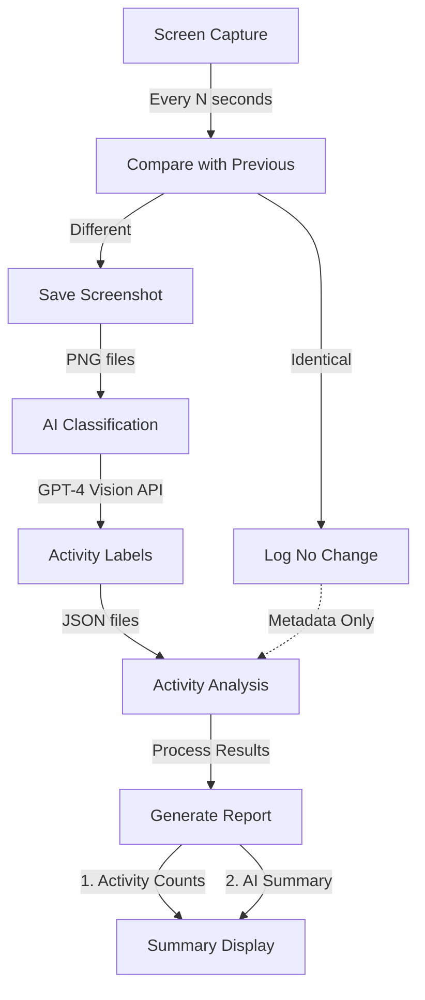

# Time Guardian ⏱️🤖💻

**AI-powered time travel for your screen**

Python-based screen activity tracker that captures images every 5 seconds for AI-powered computer usage analysis.

## Features
- Capture screenshots at regular intervals
- Analyze computer usage with AI-powered image classification
- Generate detailed time-tracking reports

## Getting started
```bash
pip install time-guardian
```

## Usage

### Track screen activity
```bash
# Track screen activity for 1 hour
time-guardian track 60

# Track with custom interval (in seconds)
time-guardian track 60 --interval 10

# Note: Screenshots are automatically saved to ~/.time-guardian/screenshots
```

### Analyze and report
```bash
# Generate an AI-analyzed report
time-guardian analyze

# View activity summary
time-guardian summary

# Check version
time-guardian version
```

### Command Details

- `track <duration>`: Start tracking screen activity
  - `duration`: Required. Duration in minutes to track
  - `--interval`: Optional. Interval between screenshots in seconds (default: 5)
  
- `analyze`: Analyze captured screenshots
  - `--screenshot-dir`: Optional. Directory containing screenshots (default: screenshots)
  - `--output`: Optional. Output file path for analysis report (default: report.txt)

- `summary`: Display activity summary
  - `--report-file`: Optional. Report file to summarize (default: report.txt)

## Pipeline Processing

 -Capture every N seconds
   - screenshots of each monitor
   - map of windows and their positions
 - compare with previous screenshot
 - if different, save screenshot
 - if identical, log no change
 - AI classification of screenshot
 - GPT-4 Vision API to get activity labels
 - JSON files for activity analysis
 - Process Results to generate report
 - Summary Display to display activity counts and AI summary




## Changelog

## Development
 
 - Install pyenv
 - Git clone the project
 - Run `make init` to create the environment and install the dependencies
 - You can now run:
   - `make help` to see the available commands
   - `make test` to run the tests
   - `make lint` to run the linter
   - `make autoformat` to format the code
   - `make type-check` to run the type checker