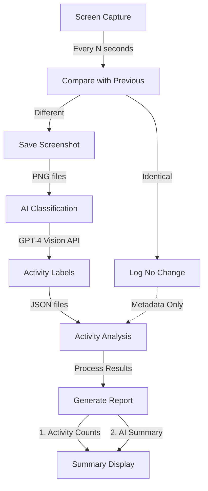

# Time Guardian ⏱️🤖💻

**AI-powered time travel for your screen**

Python-based screen activity tracker that captures images every 5 seconds for AI-powered computer usage analysis.

## Features
- Capture screenshots at regular intervals
- Analyze computer usage with AI-powered image classification
- Generate detailed time-tracking reports

## Getting started
```bash
pip install time-guardian
```

## Usage

### Track screen activity
```bash
# Track screen activity forever (until Ctrl+C)
time-guardian track

# Track for 1 hour
time-guardian track --duration 60

# Track with custom interval (in seconds)
time-guardian track --duration 60 --interval 10

# Track without AI classification
time-guardian track --no-ai

# Note: Screenshots are automatically saved to ~/.time-guardian/screenshots
```

### Analyze and report
```bash
# Generate an AI-analyzed report
time-guardian analyze-screenshots

# View activity summary
time-guardian summary

# Check version
time-guardian version
```

### Utility commands
```bash
# Check if screen recording permissions are working
time-guardian check-permissions

# Take a single screenshot
time-guardian screenshot --output my-screenshot.png

# View connected monitors
time-guardian monitors

# View visible windows
time-guardian windows

# List running processes
time-guardian processes
```

### Command Details

- `track`: Start tracking screen activity
  - `--duration`: Optional. Duration in minutes to track (default: run forever)
  - `--interval`: Optional. Interval between screenshots in seconds (default: 5)
  - `--ai/--no-ai`: Optional. Enable/disable AI classification (default: enabled)
  - `--min-pixels`: Optional. Minimum changed pixels to trigger analysis (default: 1000)
  - `--skip-permission-check`: Optional. Skip screen recording permission check
  
- `analyze-screenshots`: Analyze captured screenshots
  - `--screenshot-dir`, `-s`: Optional. Directory containing screenshots (default: screenshots)
  - `--output`, `-o`: Optional. Output file path for analysis report (default: report.txt)

- `summary`: Display activity summary

- `check-permissions`: Check if screen recording permission is granted by taking a test screenshot

- `screenshot`: Take a single screenshot
  - `--output`, `-o`: Optional. Output file path (default: screenshot.png)

- `monitors`: Display information about connected monitors
  - `--width`, `-w`: Optional. Target width in characters for visual representation (default: 90)

- `windows`: Display information about visible windows on screen
  - `--all`: Optional. Show all windows instead of just layer 0 windows

- `processes`: Display information about all running processes

## Pipeline Processing

 -Capture every N seconds
   - screenshots of each monitor
   - map of windows and their positions
 - compare with previous screenshot
 - if different, save screenshot
 - if identical, log no change
 - AI classification of screenshot
 - GPT-4 Vision API to get activity labels
 - JSON files for activity analysis
 - Process Results to generate report
 - Summary Display to display activity counts and AI summary




## Changelog

## Development
 
 - Install pyenv
 - Git clone the project
 - Run `make init` to create the environment and install the dependencies
 - You can now run:
   - `make help` to see the available commands
   - `make test` to run the tests
   - `make lint` to run the linter
   - `make autoformat` to format the code
   - `make type-check` to run the type checker


## Todo
 - [x] capture screenshots (with multi-monitor support)
 - [x] capture a map of the windows and their positions
 - [x] use window map to mask the screenshot (to ignore things like the background, dock, menu bar, etc)
 - [x] only save screenshots if there was a change from the previous screenshot
 - [x] extract per-window images
 - [x] create function that collects currently running processes and their full paths
 - [ ] create description of each window using LLM on each window image that had changes
 - [ ] collect all the descriptions and send them to LLM for normalization and summarization
 - [ ] implement activity categorization (work, entertainment, productivity, etc)
 - [ ] implement idle time detection and handling
 - [ ] implement real-time activity monitoring dashboard

 ## Future
  - [ ] implement intelligent screenshot compression to reduce storage usage
  - [ ] create privacy mode to automatically blur sensitive content (passwords, emails, etc)
  - [ ] create daily/weekly summary reports with activity trends
  - [ ] add export functionality for activity data (CSV, JSON)
  - [ ] create API endpoints for external tool integration
  - [ ] ocr text from each window image
  - [ ] train model to look specifically at browser window urls

## Won't Do
 - [ ] add configurable rules for window/application exclusions